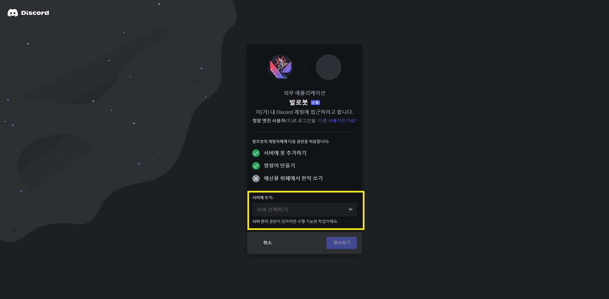
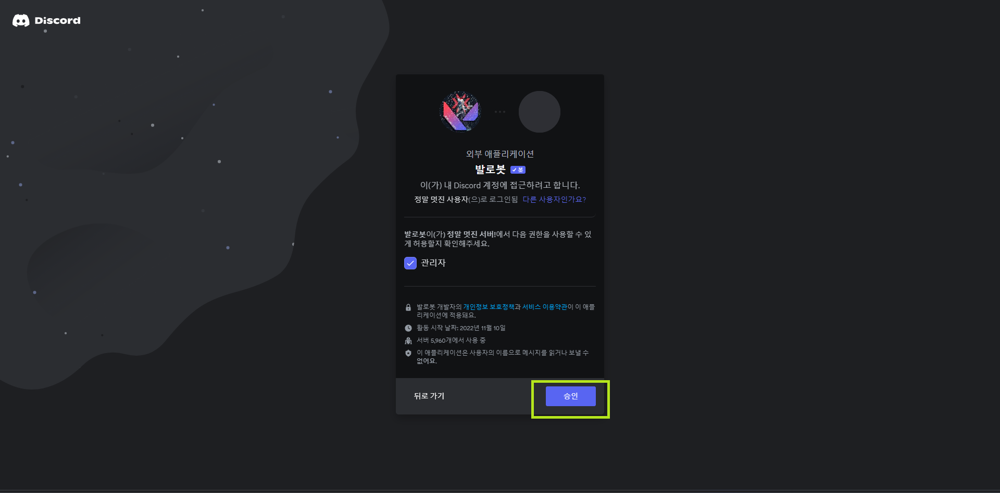
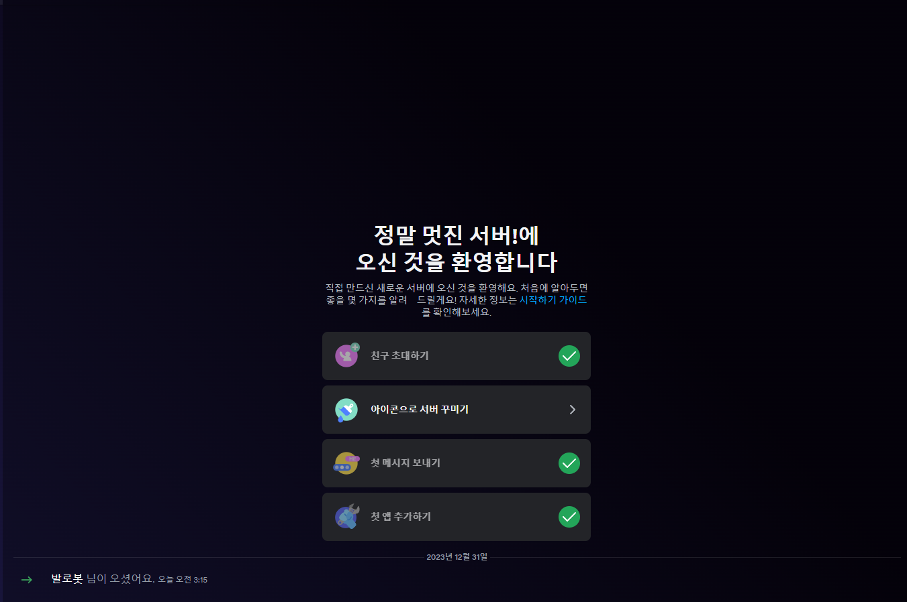

# :ticket: 발로봇 초대하기
::: warning
발로봇을 사용하려면 먼저 디스코드 서버에 초대해야해요. 
여기선 발로봇을 어떻게 초대하는지 설명해드릴게요.
:::
[여기](https://discord.com/api/oauth2/authorize?client_id=1040206071417012234&permissions=8&scope=bot%20applications.commands)를 눌러 발로봇을 초대하실 수 있어요.
::: details :computer: 초대할 서버 선택하기!
저 박스를 눌러 발로봇을 초대할 서버를 선택하고, 계속하기를 눌러주세요.

:::
::: details :hammer: 권한 승인하기
발로봇에게 주어질 권한을 확인하고, 승인하기를 눌러주세요.

:::
::: details :tada: 완료!
이제 발로봇이 서버에 도착했어요!

:::
